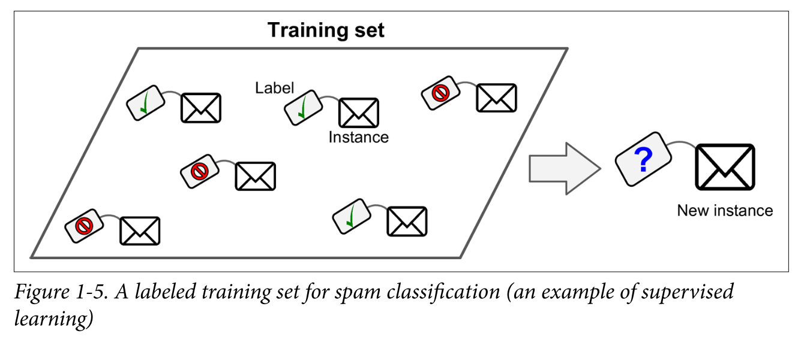
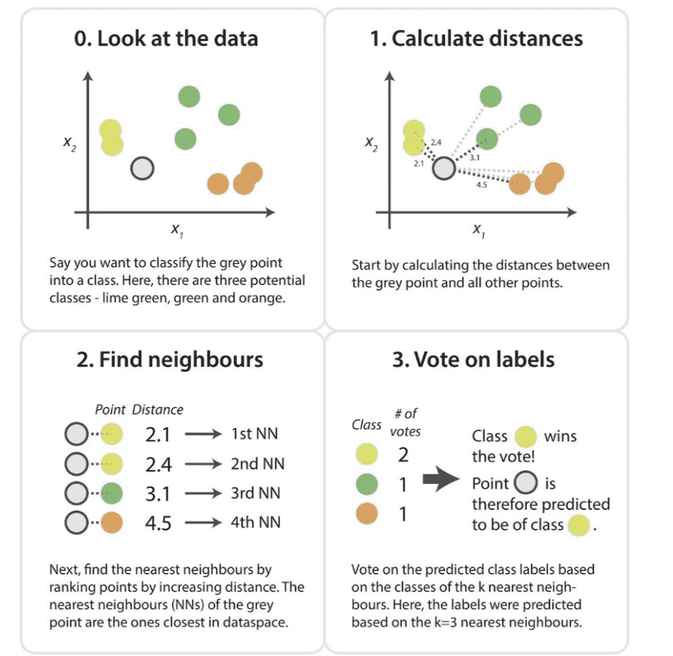
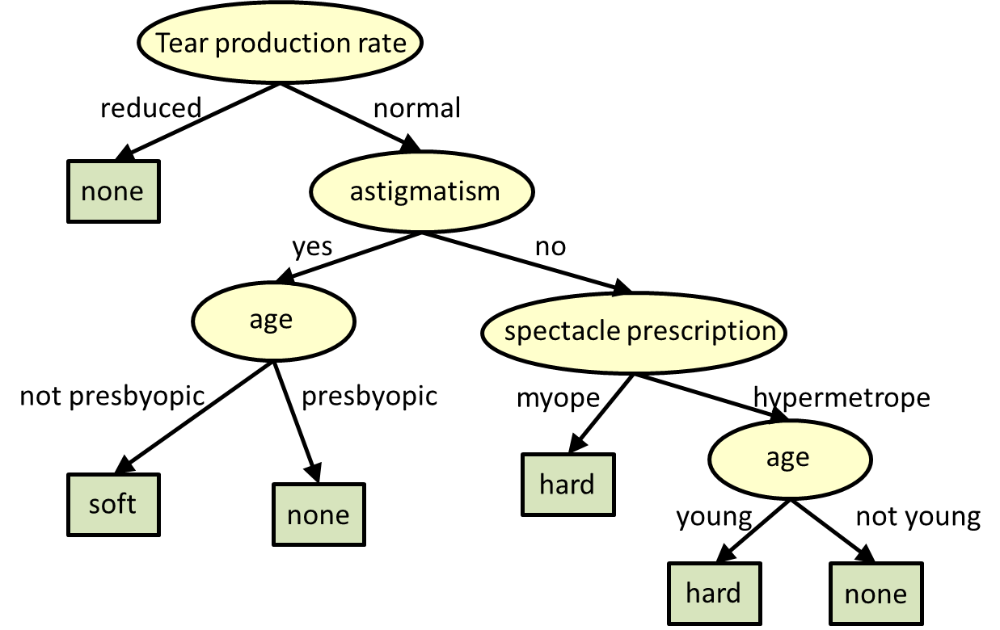
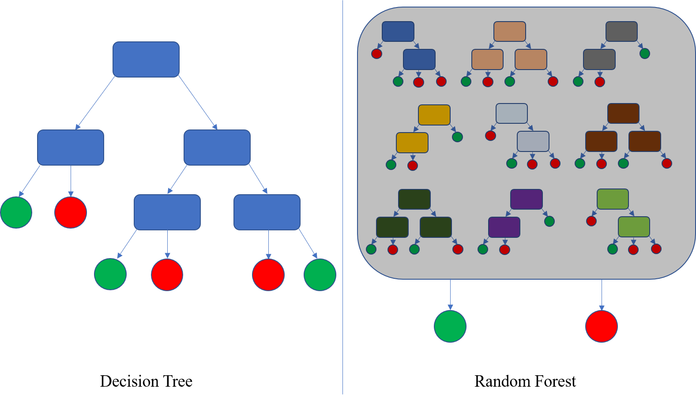
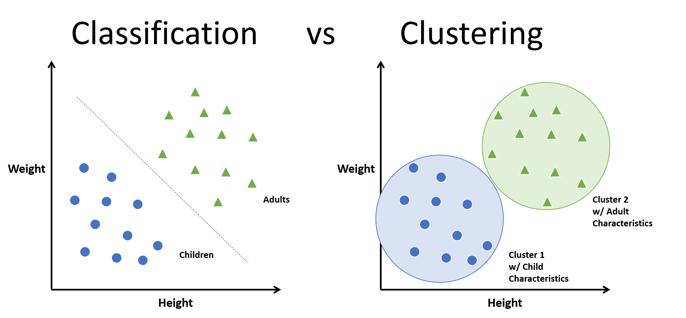
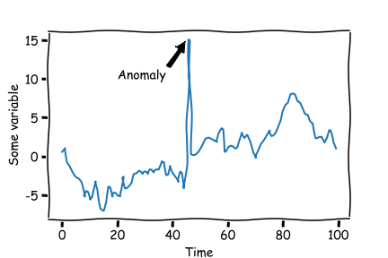
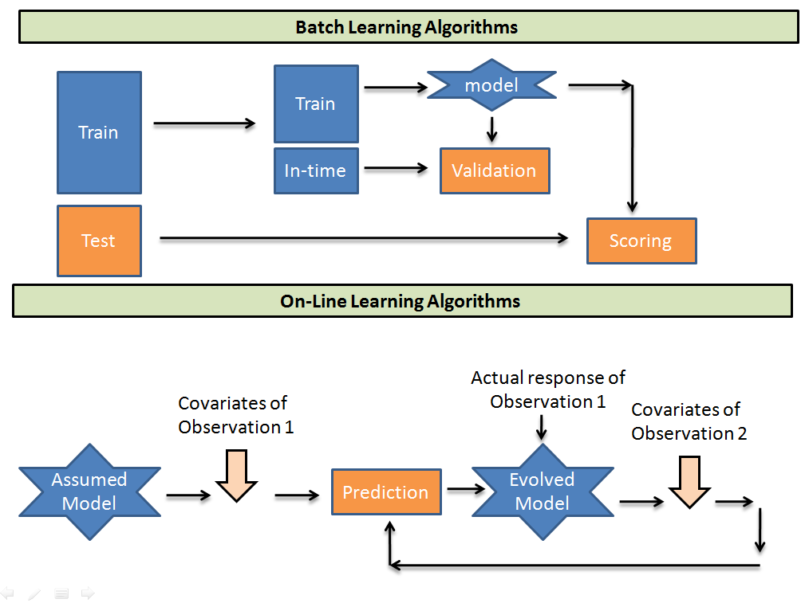

# CHAPTER 1 -  The Machine Learning Landscape

## 1. Basics
- The examples that the system uses to learn are called the training set
- Each training example is called a training instance (or sample)
- Applying ML techniques to dig into large amounts of data can help discover patterns that were not immediately apparent. This is called data mining.
  - For instance, once a spam filter has been trained on enough spam, it can easily be inspected to reveal the list of words and combinations of words that it believes are the best predictors of spam. 
  - Sometimes this will reveal unsuspected correlations or new trends, and thereby lead to a better understanding of the problem.
- To summarize, Machine Learning is great for:
  - Problems for which existing solutions require a lot of fine-tuning or long lists of rules: one Machine Learning algorithm can often simplify code and perform better than the traditional approach.
  - Complex problems for which using a traditional approach yields no good solution: the best Machine Learning techniques can perhaps find a solution.
  - Fluctuating environments: a Machine Learning system can adapt to new data.
  - Getting insights about complex problems and large amounts of data.

## 2. Types of Machine Learning Systems

There are so many different types of Machine Learning systems that it is useful to classify them in broad categories, based on the following criteria:
- Whether or not they are trained with human supervision (supervised, unsupervised, semisupervised, and Reinforcement Learning)
- Whether or not they can learn incrementally on the fly (online versus batch learning)
- Whether they work by simply comparing new data points to known data points, or instead by detecting patterns in the training data and building a predictive model, much like scientists do (instance-based versus model-based learning)

### 2.1 Supervised/Unsupervised Learning
There are four major categories: supervised learning, unsupervised learning, semisupervised learning, and Reinforcement Learning.

#### 2.1.1 Supervised learning
In supervised learning, the training set you feed to the algorithm includes the desired solutions, called labels.

##### 2.1.1.1 classification
A typical supervised learning task is ***classification***. 
- The spam filter is a good example of this: it is trained with many example emails along with their class (spam or ham), and it must learn how to classify new emails.

##### 2.1.1.2 regression

Another typical task is to predict a target numeric value, such as the price of a car, given a set of features (mileage, age, brand, etc.) called predictors.

- This sort of task is called ***regression***. To train the system, you need to give it many examples of cars, including both their predictors and their labels (i.e., their prices).

Note that some regression algorithms can be used for classification as well, and vice versa.

Here are some of the most important supervised learning algorithms (will be covered):
##### 1. k-Nearest Neighbors 
The k-nearest neighbors (KNN) algorithm is a simple, supervised machine learning algorithm that can be used to solve **both classification and regression problems**. It's easy to implement and understand, but has a major drawback of becoming significantly slows as the size of that data in use grows.

KNN tries to predict the correct class for the test data by calculating the distance between the test data and all the training points. Then select the K number of points which is closet to the test data. The KNN algorithm calculates the probability of the test data belonging to the classes of ‘K’ training data and class holds the highest probability will be selected. In the case of regression, the value is the mean of the ‘K’ selected training points.

How does K-NN work?

The K-NN working can be explained on the basis of the below algorithm:

Step-1: Select the number K of the neighbors
Step-2: Calculate the Euclidean distance of K number of neighbors
Step-3: Take the K nearest neighbors as per the calculated Euclidean distance.
Step-4: Among these k neighbors, count the number of the data points in each category.
Step-5: Assign the new data points to that category for which the number of the neighbor is maximum.
Step-6: Our model is ready.

##### 2.Linear Regression 
Linear regression is a linear approach for modelling the relationship between a scalar response and one or more explanatory variables (also known as dependent and independent variables).

##### 3. Logistic Regression 
Linear regression is used to predict the continuous dependent variable using a given set of independent variables. Logistic Regression is used to predict the categorical dependent variable using a given set of independent variables.

##### 4. Support Vector Machines (SVMs)
Support-vector machines (SVMs, also support-vector networks) are supervised learning models with associated learning algorithms that analyze data for classification and regression analysis.

##### 5. Decision Trees and Random Forests
A decision tree is a decision support tool that uses a tree-like model of decisions and their possible consequences, including chance event outcomes, resource costs, and utility. It is one way to display an algorithm that only contains conditional control statements.

A random forest is simply a collection of decision trees whose results are aggregated into one final result.

##### 6. Neural networks
**_NOTE:_**  Some neural network architectures can be unsupervised, such as autoencoders and restricted Boltzmann machines. They can also be semisupervised, such as in deep belief networks and unsupervised pretraining.
#### 2.1.2 Unsupervised learning

In unsupervised learning, the training data is unlabeled. The system tries to learn without a teacher.

Here are some of the most important unsupervised learning algorithms :
##### 1. Clustering 

  - K-Means 
  - DBSCAN 
  - Hierarchical Cluster Analysis (HCA)
##### 2. Anomaly detection and novelty detection 
The system is shown mostly normal instances during training, so it learns to recognize them; then, when it sees a new instance, it can tell whether it looks like a normal one or whether it is likely an anomaly.

A very similar task is novelty detection: it aims to detect new instances that look different from all instances in the training set. This requires having a very “clean” training set, devoid of any instance that you would like the algorithm to detect. For example, if you have thousands of pictures of dogs, and 1% of these pictures represent Chihuahuas, then a novelty detection algorithm should not treat new pictures of Chihuahuas as novelties. On the other hand, anomaly detection algorithms may consider these dogs as so rare and so different from other dogs that they would likely classify them as anomalies (no offense to Chihuahuas).

  - One-class SVM 
  -  Isolation Forest
##### 3. Visualization and dimensionality reduction 
**Visualization** algorithms are  good examples of unsupervised learning algorithms: you feed them a lot of complex and unlabeled data, and they output a 2D or 3D representation of your data that can easily be plotted.

A related task is **dimensionality reduction**, in which the goal is to simplify the data without losing too much information. One way to do this is to merge several correlated features into one. For example, a car’s mileage may be strongly correlated with its age, so the dimensionality reduction algorithm will merge them into one feature that represents the car’s wear and tear. This is called **feature extraction**.

  - Principal Component Analysis (PCA) 
  - Kernel PCA 
  -  Locally Linear Embedding (LLE) 
  -   t-Distributed Stochastic Neighbor Embedding (t-SNE)

##### 4. Association rule learning 
The goal is to dig into large amounts of data and discover interesting relations between attributes.

For example, suppose you own a supermarket. Running an association rule on your sales logs may reveal that people who purchase barbecue sauce and potato chips also tend to buy steak. Thus, you may want to place these items close to one another.

  - Apriori
  -  Eclat
  
#### 2.1.3 Semisupervised learning
Since labeling data is usually time-consuming and costly, you will often have plenty of unlabeled instances, and few labeled instances. Some algorithms can deal with data that’s partially labeled. This is called semisupervised learning

#### 2.1.4 Reinforcement learning
Reinforcement Learning is a very different beast. The learning system, called an agent in this context, can observe the environment, select and perform actions, and get rewards in return (or penalties in the form of negative rewards)

### 2.2 Batch and Online Learning

Another criterion used to classify Machine Learning systems is whether or not the system can learn incrementally from a stream of incoming data.
#### 2.2.1 Batch learning
In batch learning, the system is incapable of learning incrementally: it must be trained using all the available data. This will generally take a lot of time and computing resources, so it is typically done offline. First the system is trained, and then it is launched into production and runs without learning anymore; it just applies what it has learned. This is called offline learning.

If you want a batch learning system to know about new data (such as a new type of spam), you need to train a new version of the system from scratch on the full dataset (not just the new data, but also the old data), then stop the old system and replace it with the new one.

Fortunately, the whole process of training, evaluating, and launching a Machine Learning system can be automated fairly easily (as shown in Figure 1-3), so even a batch learning system can adapt to change. Simply update the data and train a new version of the system from scratch as often as needed. This solution is simple and often works fine, but training using the full set of data can take many hours, so you would typically train a new system only every 24 hours or even just weekly. If your system needs to adapt to rapidly changing data (e.g., to predict stock prices), then you need a more reactive solution.
#### 2.2.2 Online learning
Online learning is great for systems that **receive data as a continuous flow** (e.g., stock prices) and need to adapt to change rapidly or autonomously. It is also a good option if you have **limited** **computing resources**: once an online learning system has learned about new data instances, it does not need them anymore, so you can discard them (unless you want to be able to roll back to a previous state and “replay” the data). This can save a huge amount of space. 

Online learning algorithms can also be used to train **systems on huge datasets that cannot fit in one machine’s main memory** (this is called out-of-core learning). The algorithm loads part of the data, runs a training step on that data, and repeats the process until it has run on all of the data

**One important parameter of online learning systems is how fast they should adapt to changing data: this is called the learning rate.** If you set a high learning rate, then your system will rapidly adapt to new data, but it will also tend to quickly forget the old data (you don’t want a spam filter to flag only the latest kinds of spam it was shown). Conversely, if you set a low learning rate, the system will have more inertia; that is, it will learn more slowly, but it will also be less sensitive to noise in the new data or to sequences of nonrepresentative data points (outliers).

**A big challenge with online learning is that if bad data is fed to the system, the system’s performance will gradually decline**. If it’s a live system, your clients will notice. For example, bad data could come from a malfunctioning sensor on a robot, or from someone spamming a search engine to try to rank high in search results. To reduce this risk, you need to monitor your system closely and promptly switch learning off (and possibly revert to a previously working state) if you detect a drop in performance. You may also want to monitor the input data and react to abnormal data (e.g., using an anomaly detection algorithm).

### 2.3 Instance-Based Versus Model-Based Learning
#### 2.3.1 Instance-based learning
A family of learning algorithms that, instead of performing explicit generalization, compare new problem instances with instances seen in training, which have been stored in memory.

The system learns the examples by heart, then generalizes to new cases by using a similarity measure to compare them to the learned examples (or a subset of them)
#### 2.3.2 Model-based learning
Another way to generalize from a set of examples is to build a model of these examples and then use that model to make predictions. This is called model-based learning

## 3.  Main Challenges of Machine Learning
  - Insufficient Quantity of Training Data
  - Nonrepresentative Training Data
  
  It is crucial to use a training set that is representative of the cases you want to generalize to. This is often harder than it sounds: if the sample is too small, you will have sampling noise (i.e., nonrepresentative data as a result of chance), but even very large samples can be nonrepresentative if the sampling method is flawed. This is called sampling bias.
  - Poor-Quality Data
    -  If some instances are clearly outliers, it may help to simply discard them or try to fix the errors manually.
    -  If some instances are missing a few features (e.g., 5% of your customers did not specify their age), you must decide whether you want to ignore this attribute altogether, ignore these instances, fill in the missing values (e.g., with the median age), or train one model with the feature and one model without it.
  - Irrelevant Features
    - A critical part of the success of a Machine Learning project is coming up with a good set of features to train on. This process, called feature engineering, involves the following steps:
      - Feature selection (selecting the most useful features to train on among existing features)
      - Feature extraction (combining existing features to produce a more useful one—as we saw earlier, dimensionality reduction algorithms can help)
      - Creating new features by gathering new data
  - Overfitting the Training Data
    - the model performs well on the training data, but it does not generalize well.
    - Overfitting happens when the model is too complex relative to the amount and noisiness of the training data. 
      - Simplify the model by selecting one with fewer parameters (e.g., a linear model rather than a high-degree polynomial model), by reducing the number of attributes in the training data, or by constraining the model.
      - Gather more training data.
      - Reduce the noise in the training data (e.g., fix data errors and remove outliers).
       
**_NOTE:_** Constraining a model to make it simpler and reduce the risk of overfitting is called **regularization**. For example, the linear model we defined earlier has two parameters, $θ_0$ and $θ_1$ . This gives the learning algorithm two degrees of freedom to adapt the model to the training data: it can tweak both the height ($θ_0$ we forced $θ_1$) and the slope ($θ_1$) of the line. 
  
If $θ_1$ = 0, the algorithm would have only one degree of freedom and would have a much harder time fitting the data properly: all it could do is move the line up or down to get as close as possible to the training instances, so it would end up around the mean. A very simple model indeed! 

If we allow the algorithm to modify $θ_1$ but we force it to keep it small, **then the learning algorithm will effectively have somewhere in between one and two degrees of freedom.** It will produce a model that’s simpler than one with two degrees of freedom, but more complex than one with just one. You want to find the right balance between fitting the training data perfectly and keeping the model simple enough to ensure that it will generalize well.

- Underfitting the Training Data
  - it occurs when your model is too simple to learn the underlying structure of the data.
    - Select a more powerful model, with more parameters. 
    - Feed better features to the learning algorithm (feature engineering). 
    - Reduce the constraints on the model (e.g., reduce the regularization hyperparameter).

## 4. Testing and Validating
- split your data into two sets: the training set and the test set. 
  - you train your model using the training set, and you test it using the test set
  - The error rate on new cases is called the generalization error (or out-ofsample error), and by evaluating your model on the test set, you get an estimate of this error.
    - This value tells you how well your model will perform on instances it has never seen before.
    - If the training error is low (i.e., your model makes few mistakes on the training set) but the generalization error is high, it means that your model is overfitting the training data.

### 4.1 Hyperparameter Tuning and Model Selection
- you simply hold out part of the training set to evaluate several candidate models and select the best one. The new held-out set is called the validation set (or sometimes the development set, or dev set).
- More specifically, you train multiple models with various hyperparameters on the reduced training set (i.e., the full training set minus the validation set), and you select the model that performs best on the validation set. After this holdout validation process, you train the best model on the full training set (including the validation set), and this gives you the final model. Lastly, you evaluate this final model on the test set to get an estimate of the generalization error.
- There is a drawback, however: the training time is multiplied by the number of validation sets.

### 4.2 Data Mismatch
- the most important rule to remember is that the validation set and the test set must be as representative as possible of the data you expect to use in production, so they should be composed exclusively of representative pictures: you can shuffle them and put half in the validation set and half in the test set
- But after training your model on the web pictures, if you observe that the performance of the model on the validation set is disappointing, you will not know whether this is because your model has overfit the training set, or whether this is just due to the mismatch between the web pictures and the mobile app pictures
- One solution is to hold out some of the training pictures (from the web) in yet another set that Andrew Ng calls the train-dev set. After the model is trained (on the training set, not on the train-dev set), you can evaluate it on the train-dev set. If it performs well, then the model is not overfitting the training set. If it performs poorly on the validation set, the problem must be coming from the data mismatch. You can try to tackle this problem by preprocessing the web images to make them look more like the pictures that will be taken by the mobile app, and then retraining the model. Conversely, if the model performs poorly on the train-dev set, then it must have overfit the training set, so you should try to simplify or regularize the model, get more training data, and clean up the training data.